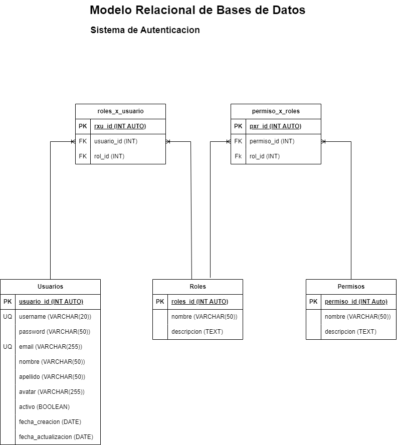

# Sistema de Autenticacion

## Listado de Entidades

### usuarios **(ED)**

- usuario_id **(PK)**
- username  **(UQ)**
- password
- email  **(UQ)**
- nombre
- apellido
- avatar
- activo
- fecha_creacion
- fecha_actualizacion

### roles **(EC)**

- rol_id **(PK)**
- nombre
- descripcion

### permisos **(EC)**

- permiso_id **(PK)**
- nombre
- descripcion

### roles_x_usuario **(EP)**

- rxu_id **(PK)**
- usuario_id **(FK)**
- rol_id **(FK)**

### permisos_x_roles **(EP)**

- pxr_id **(PK)**
- rol_id **(Fk)**
- permiso_id **(FK)**

## Relaciones

1. Un **usuario** tiene **roles** (_1 a M_)
1. Un **usuario** tiene **permisos** (_1 a M_)
1. Un **rol** tiene **permisos** (_1 a M_)

## Diagramas

### Modelo Relacional de la Base de Datos

## Reglas de Negocio

### usuarios

1. Crear un usuario.
1. Leer todos los usuarios.
1. Leer un usuario en particular.
1. Actualizar usuario.
1. Validar un usuario.
1. Habilitar un usuario.
1. Inhabilitar un usuario.
1. Actualizar datos de un usuario.
1. Actualizar password de un usuario.
1. Eliminar usuario.

### roles

1. Crear un rol.
1. Leer todos los roles.
1. Leer un rol en particular.
1. Actualizar un rol.
1. Eliminar un rol.

### permisos

1. Crear un permiso.
1. Leer todos los permiso.
1. Leer un permiso en particular.
1. Actualizar un permiso.
1. Eliminar un permiso.

### roles_x_usuarios

1. Crear un rxu.
1. Leer todos los rxu.
1. Leer un rxu en particular.
1. Leer todos los rxu de un usuario.
1. Eliminar un rxu.

### permiso_x_roles

1. Crear un pxr.
1. Leer todos los pxr.
1. Leer un pxr en particular.
1. Leer todos los pxr de un rol.
1. Eliminar un pxr.