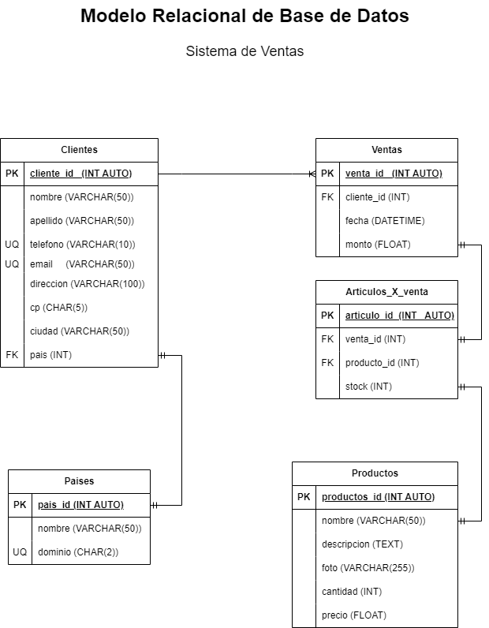

# Ventas

## Listado de Entidades

### Clientes **(ED)**

- cliente_id **(PK)**
- nombre
- apellido
- telefono **(UQ)**
- email **(UQ)**
- direccion
- cp
- ciudad
- pais **(FK)**

### Productos **(ED|EC)**

- producto_id **(PK)**
- nombre
- descripcion
- foto
- precio
- cantidad

### Ventas

_ venta_id **(PK)**
- cliente_id **(FK)**
- fecha
- monto

### articulos_x_venta **(EP)**

- articulo_id **(PK)**
- venta_id **(FK)**
- producto_id **(FK)**
- stock

### paises **(EC)**

- pais_id **(PK)**
- nombre
- dominio **(UQ)**

## Relaciones

1. Un **cliente** tiene un **país** (_1 - 1_).
1. Una **venta** tiene un **cliente** (_1 - 1_).
1. Una **venta** tiene **artículos** (_1 - M_).
1. Un **artículo** es un **producto** (_1 - 1_).

## Modelo Relacional

## Reglas de negocio

### clientes

1. Crear un cliente.
1. Leer todos los clientes.
1. Leer un cliente en particular.
1. Actualizar un cliente.
1. Eliminar un cliente.

### productos

1. Crear un producto.
1. Leer todos los productos.
1. Leer un producto en particular.
1. Actualizar productos.
1. Eliminar productos.
1. Cada vez que haya una venta disminuir el stock de ese producto en la cantidad vendida.

### ventas

1. Crear una venta.
1. Leer todas las ventas.
1. Leer una venta en particular.
1. Leer todas las ventas de un cliente.
1. Leer todas las ventas de un producto.
1. Actualizar una venta.
1. Eliminar una venta.

### articulos_x_venta

1. Crear un articulo.
1. Leer todos los articulos.
1. Leer un articulo en particular
1. Leer todos los articulos de una venta.
1. Leer todos los articulos de un producto.
1. Leer todos los articulos de un cliente.
1. Actualizar un articulo.
1. Eliminar un articulo.

### paises

1. crear un pais.
1. Leer todos los paises.
1. Leer un pais en particular.
1. Actualizar un pais.
1. Eliminar un pais.