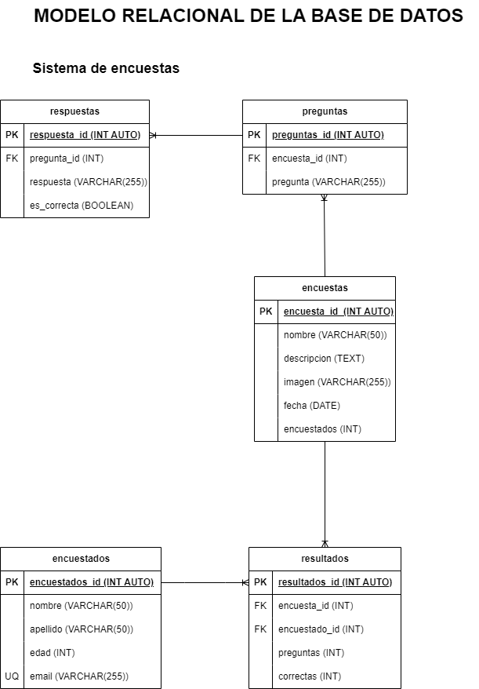

# Encuestas

## Listado de Entidades

### encuestas **(ED)**

- encuesta_id **(PK)**
- nombre 
- descripcion
- imagen
- fecha
- encuestados

### preguntas **(ED)**

- pregunta_id **(PK)**
- encuesta_id **(FK)**
- pregunta

### respuestas **(ED)**

- respuesta_id **(PK)**
- pregunta_id **(FK)**
- respuesta
- es_correcta

### encuestados **(ED)**

- encuestado_id **(PK)**
- nombre 
- apellido
- edad
- email **(UQ)**

### resultados **(ED|EP)**

- resultado_id **(PK)**
- encuesta_id **(FK)**
- encuestado_id **(FK)**
- preguntas
- correctas

## Relaciones

1. Una **encuesta** tiene **preguntas** (_1 a M_)
1. Una **pregunta** tiene **respuesta**  (_1 a M_)
1. Una **encuesta** tiene **resultados** (_1 a M_)
1. Un **encuestado** tiene **resultados** (_1 a M_)

## Diagramas

### Modelo Relacional de la base de datos

## Reglas de negocio

### encuestas

1. Crear una encuesta.
1. Leer todas las encuestas.
1. Leer una encuesta en particular.
1. Actualizar una encuesta.
1. Eliminar una encuesta.
1. Aumentar en 1 el valor del atributo encuestados cada vez que se complete una encuesta.

### preguntas

1. Crear una preguntas.
1. Leer todas las preguntas.
1. Leer una pregunta en particular.
1. Actualizar una pregunta.
1. Eliminar una pregunta.

### respuestas

1. Crear una respuesta.
1. Leer todas las respuesta.
1. Leer una respuesta en particular.
1. Actualizar una respuesta.
1. Eliminar una respuesta.

### encuestados

1. Crear un encuestado.
1. Leer todos los encuestado.
1. Leer un encuestado en particular.
1. Actualizar un encuestado.
1. Eliminar un encuestado.
1. Antes de crear un encuestado en la entidad, verificar mediante su email que no exista.

### resultados

1. Crear un resultado.
1. Leer todos los resultado.
1. Leer un resultado en particular.
1. Actualizar un resultado.
1. Eliminar un resultado.